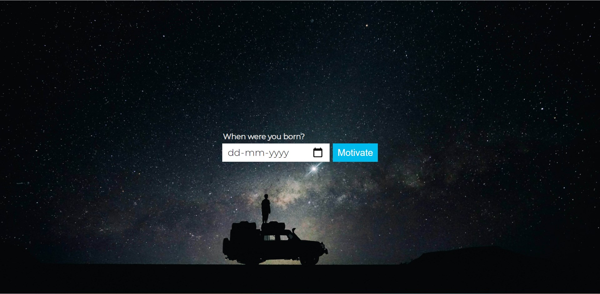
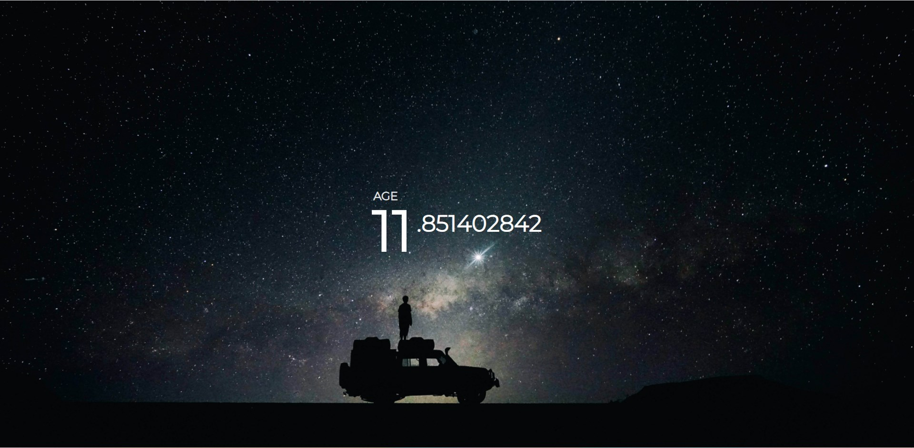

#### An extension to show you how much time YOU HAVE WASTED! (yay!)

### Screenshots: 

#### This extension is not completely made by me, it's just modified by me.

### How to install :-
1. Download the repository.
2. Extract the downloaded zip.
3. Go to you chrome extension page.
4. Turn on developer mode.
5. Drag the downloaded zip file in that tab.

#### Real Extension - [Time is Running](https://chrome.google.com/webstore/detail/time-is-running/ijnaleaamhgpjmpmjefcnkkjjckbidnf?hl=en)
